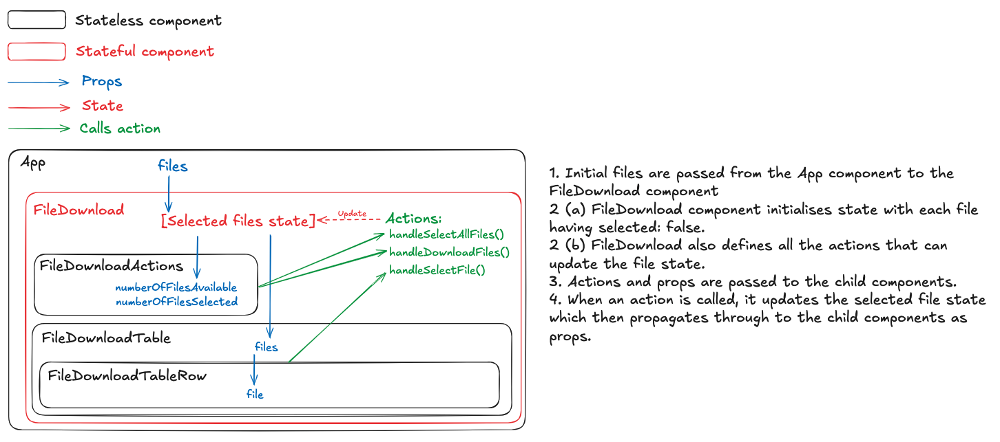

# File Download UI

This project was scaffolded with [React + Vite + TypeScript](https://github.com/vitejs/vite/tree/main/packages/create-vite/template-react-ts) + [SASS](https://vite.dev/guide/features.html#css-pre-processors). It is also using [Vitest](https://vitest.dev/guide/) and [RTL](https://testing-library.com/docs/react-testing-library/intro/) for unit and integration testing, and [ESLint](https://eslint.org/) and [Prettier](https://prettier.io/) for linting and formatting.

I have prior experience with Ember.js, but have been using React.js more in recent years so decided to use it for this task.

The project is hosted here: https://andyhedwards.github.io/file-download-ui/

## Local setup

To start the local development server run the following commands in the root of the project...

```js
npm install
npm run dev

// Server runs on http://localhost:5173/
```

and then to run the tests...

```js
npm run test
```

## Architecture



## Testing

Due to time constraints for this task, I haven't gone overboard with testing but have included some examples of the kind of tests I would generally like to see for a component like this. Namely, the more integration-style tests in `FileDownload.test.tsx` that interact with the component like an actual user would, and then more traditional unit tests to capture the logic around the `capitaliseFirstLetter` utility function. Between these tests, I have achieved 100% code coverage (of the FileDownload component and its children, at least) without getting bogged down testing implementation details.

## Styling

Again, given the limited time to complete this challenge, I decided to go ahead with a pretty basic SASS + BEM styling approach. Each component has an associated SASS file with a top-level "Block" with subsequent "Elements" and "Modifiers" where necessary. A child component would then define its own top-level "Block". To make this more robust in a production environment, we could consider combining this approach with something like CSS Modules to handle naming conflicts / scoping for us, but again, this seemed like overkill for this task.

## Mobile responsive

To make the file download component mobile responsive, the table can scroll left and right while the download actions remain in place. I also set the font-size to 85% on mobile devices, which, combined with using REMs for padding, makes everything slightly more compact on smaller screens.
